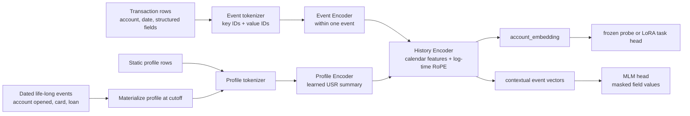

# Architecture note

PRAGMA-lite keeps the structural idea from PRAGMA while using a deliberately
small manual PyTorch Transformer. There is no text tokenizer because the Czech
records expose structured categorical fields but no transaction description.
Each event is six key/value pairs: transaction type, operation, category,
other bank ID, absolute amount bucket, and post-transaction balance bucket.
Keys and values have separate embedding tables and their vectors are added.

## Timing and masking

Rows contain dates rather than intraday timestamps, so events from the same
account/day use the stable source `trans_id` as a deterministic tie-breaker.
The model does not invent intraday precision. Event-history positions use the
soft log elapsed-time coordinate `8 * ln(1 + seconds / 8)`; daily calendar
features are included as the available day-level cycles. Profile life-long
events have their own dated coordinates so `account_opened`, card issuance,
and loan grant are visible only when they have occurred.

Masked value modelling corrupts individual fields, complete events, and the
same field across a history. The MLM head predicts the original value token at
selected positions. Its contextual field representation is the local Event
Encoder field vector plus its contextualized History Encoder event vector,
allowing this one loss to update the Event, Profile, and History encoders.

## Downstream adaptation

The task head reads `account_embedding`, the first History Encoder output. A
frozen linear probe establishes whether the checkpoint carries useful signal.
If it is competitive, `LoRALinear` wraps only the History Encoder’s Q/K/V and
MLP input/output projections. All base weights stay frozen. LoRA-B begins at
zero, so attaching an adapter initially produces exactly the frozen model
output. The rank sweep is 4, 8, and 16; rank 8 is the default aligned with the
[PRAGMA paper](https://arxiv.org/html/2604.08649v1), while history-only
adaptation is a consciously smaller-project scope choice.
